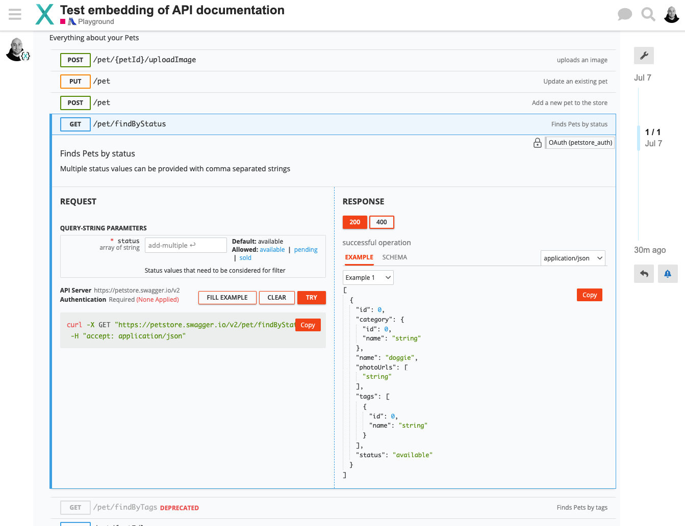

# Discourse Rapidoc Theme Component

This is a [Discourse theme component](https://meta.discourse.org/t/beginners-guide-to-using-discourse-themes/91966) that uses [RapiDoc](https://rapidocweb.com/) to render OpenAPI specifications inline in Discourse topics.

Based off the nice official [Discourse mermaid component](https://github.com/discourse/discourse-mermaid-theme-component).

To use it ...

- [install it](https://meta.discourse.org/t/install-a-theme-or-theme-component/63682) into your Discourse instance
- in a topic, create a code block and use `apidoc` as language tag and the URL of an OpenAPI specification url as the block's content.

````
```apidoc
https://petstore.swagger.io/v2/swagger.json
````

If specification is not publicly accessible, you can attach the specification file to your post and copy the URL after the file has been uploaded.

Here's how it could look like

